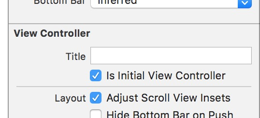

xcode 一些坑

1. Main.storyboard失效了，显示不出来。

	新建的一个工程，通常Main.storyboard是自动加载到工程中去的，AppDelegate中不用做任何操作，就可以显示默认的Main.storyboard。但是有时候，死活Main.storyboard突然失效了，就是显示不出来。这个就是因为”Is Initial View Controller“这一项没有勾上。勾上之后就可以了。

2. #遇到一个bug xcode工程中，test文件加到了主targe中。结果在run时一直出现XCTest.framework找不到crash！！！xcode中杜绝不同targe中的文件乱互相添加

3. WhaleyVR app 中使用的SocketIO.framework  总是报image load fail；
   解决办法：把SocketIO再运行WhaleyVR 的机器上重新打包合并出模拟器真机的framework，放到wahleyVR工程中即可（怀疑时SocketIO依赖的swift版本或iosSDK版本有差别，所以每次都要在新电脑上重新编译对应的版本）
