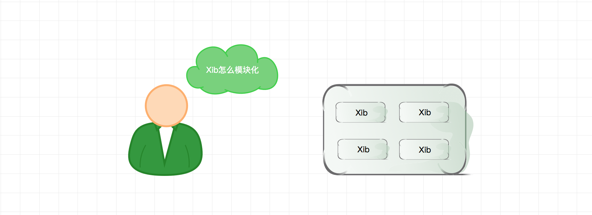

# ios xib 模块化组件

对于一个组件，最原始单位是UIView，想要使用xib组件，可以xib作为UIView的contentView。

具体实践 借用[一叶博客
](http://00red.com/blog/2016/07/27/tips-swift-xib-modular-design/)

ILDemoView.xib 为一个组件，他有一个同名类 ILDemoView.swift 继承自ILXibView.swift ILXibView实现了加载contentView逻辑。