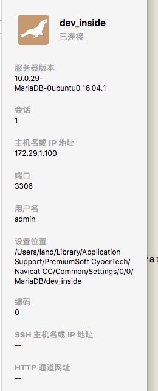

#MariaDB重置密码
###本次事件导火索：
公司内部服务器断电后重启失败电脑主板坏掉，经过维修后，ip变掉。

* MariaDB版本信息见下图：



* 运行mysql命令后出现如下错误：

 * ERROR 1524 (HY000): Plugin 'auth_socket' is not loaded
	
	
###然后进入重置root密码阶段
1. 第一步，
	```
	sudo su
	```
	（获取命令行超级用户权限）

2. 第二步，
	```
	kill -9 $(pgrep mysql)
	```
	（关掉所有mysql进程）
3. 第三步，
	```
	mysqld_safe --skip-grant-tables & 
	```
	（以跳过用户授权验证方式启动mysql服务）
4. 第四步，
	```
	mysql -u root
	```
	（进入MariaDB命令行）
5. MariaDB [(none)]> 
	```
	use mysql;
	```
6. MariaDB [mysql]>
	```
   select * from mysql.user;
	```
7. MariaDB [mysql]> 
	```
	UPDATE user SET Password=PASSWORD('') where USER='root';
	```
	（把root用户密码置空） 

  * 在第七步之前执行了MariaDB [mysql]> 
	```
  	UPDATE user SET authentication_string=PASSWORD('123456abc') where USER='root';
  	```
  	又执行了
  	```
  	UPDATE user SET Password =PASSWORD('123456abc') where USER='root';
  	```

  * 然后导致一直登陆到mysql失败 ![ERROR 1045 (28000): Access denied for user 'root'@'localhost' (using password: YES)]
  
8. 最终安装步骤7把root密码置空后登陆mysql，在mysql命令行下修改root用户密码成

#创建用户
#### <a name="fenced-code-block">创建一个admin用户</a>
```
MariaDB [(none)]> CREATE USER 'admin'@'%' IDENTIFIED BY '123456abc'; 
MariaDB [(none)]> show grants for root;
MariaDB [(none)]> GRANT All ON *.* TO 'admin'@'%';
MariaDB [(none)]> FLUSH PRIVILEGES;
```


